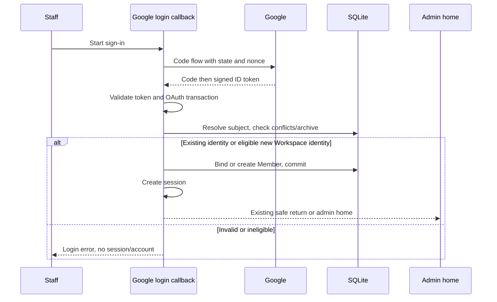
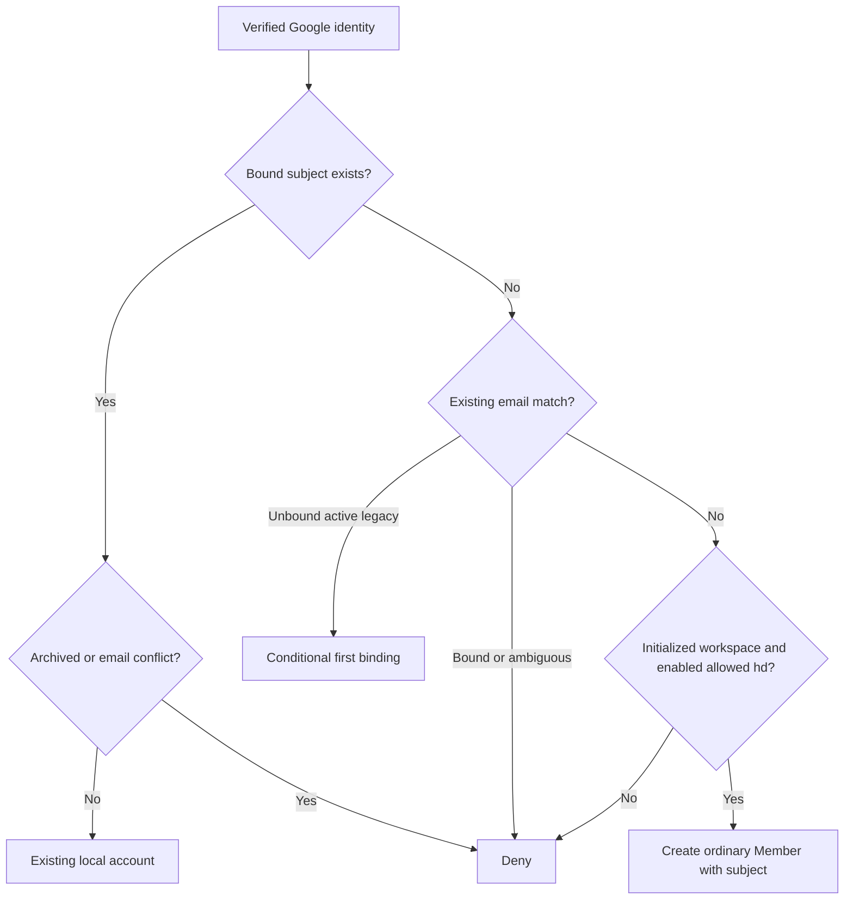

# Google Workspace Self-Service - Plan

## Goal Capsule

- **Objective:** CoderPush staff can enter Calnode with their company Google account and set up their own working hours and booking links without waiting for an invitation.
- **Means:** Extend Google sign-in with configurable Workspace admission and stable account binding (KTD1–KTD4).
- **Authority:** Product Contract governs behavior; Planning Contract governs mechanisms within it. User instructions override both.
- **Execution profile:** Bounded feature on the maintained v0.10.1 fork; implement, review, deploy, and verify within the existing authorization. Use sequential specialist work and GPT-6.1 Sol for implementation.
- **Stop conditions:** Stop for an identity conflict or unsafe migration that cannot satisfy R3/R4; report incomplete live first-member proof without impersonating staff.
- **Owner and landing:** The implementation owner completes all units and consequential code review, then ships the reviewed fork revision to Railway. No upstream upgrade is part of this change.

---

## Product Contract

### Summary

Add operator-controlled Google Workspace self-service signup to the existing admin login. New staff receive their own Member account and the existing setup checklist guides them through timezone, Calendar consent, working hours, and an event type.

### Problem Frame

The deployed company scheduler currently accepts only an existing user's Google email. Its invitation claim requires an initial password, so staff cannot enter through their company Google account alone. Only the known owner is present; Sales has no members or pending invitations.

### Key Decisions

- **Google self-service for company staff** (session-settled: user-directed — chosen over invitation-based onboarding: staff should enter with their company Google account without manual provisioning). Governs R1, R2, R5.

### Requirements

**Admission and identity**

- R1. A new user may sign in at `/admin/login` using Google when self-service is enabled and the verified Google Workspace domain is allowed; ordinary typed email and request `hd` hints do not establish eligibility.
- R2. Self-service is configurable, disabled by default, and requires a nonempty exact domain allowlist; the deployed policy will allow `coderpush.com` without hardcoding company or employee identities in application code.
- R3. New Google accounts bind to Google's stable subject; repeat logins resolve that identity without merging distinct people who share or reuse an email address.
- R4. Archived users remain blocked and existing owner/admin/member permissions never change through signup or identity binding.
- R5. A provisioned user starts as an ordinary Member with no password requirement, API key, team assignment, availability rules, or connected Calendar.

**User setup and compatibility**

- R6. Staff see a clear path to confirm timezone, connect their own Calendar, set working hours, and create their own event type; signup never grants Calendar consent on their behalf.
- R7. Existing Google, Microsoft, password, invitation, session, and MCP-return behavior remains compatible except that a conflicting bound Google subject is denied.
- R8. Each member's calendars, availability, event types, and bookings remain scoped to that member through existing authorization.

**Administration and delivery**

- R9. Operators can read and change the same effective signup policy through the Google settings API and UI; policy-only updates preserve credentials, including environment-backed credentials.
- R10. No staff emails are sent and no staff join Sales automatically; Lily and Min's Sales membership remains an explicit separate action.
- R11. Deploy against the existing fork and protect current owner access and Calendar integration with a backup and controlled verification.

### Acceptance Examples

- AE1. Covers R1, R2, R5. A previously unknown user with a valid signed Workspace identity on the allowed domain enters as one Member without claiming an invitation.
- AE2. Covers R1, R4. A Gmail identity, a matching email suffix without allowed signed `hd`, an archived account, or a mismatched bound subject cannot create or recover an account.
- AE3. Covers R3, R7. A bound Google identity returns to the same local account after a Google email rename; a different subject using its old email cannot claim that row.
- AE4. Covers R6, R8, R10. A new Member follows the setup links, grants separate Calendar consent, and sees only their own data; Sales stays empty until its membership is explicitly changed.

### Scope Boundaries

This release changes Google admission, subject binding, operator settings, and small setup guidance. It does not redesign invitations, Microsoft signup, generic account linking, or the dashboard.

Considered and not built: real-time Workspace offboarding synchronization. Existing local archive enforcement blocks app access; a Directory API synchronization system is beyond the requested signup outcome. Reconsider it if company policy requires immediate central revocation of already issued app sessions.

---

## Planning Contract

### Assumptions

- The inherited Google email-login trust can be preserved for a legacy unbound row's first signed Google login. This cannot distinguish a recycled address from its former owner; current live evidence contains only the known, already tested owner. Verify and bind that owner before enabling self-service.
- Setup guidance should reuse the current Getting started checklist and existing screens; no wizard or guessed working hours are needed.
- Runtime policy lives in SQLite only. No new environment policy override is needed; environment-backed Google credentials remain supported.

### Key Technical Decisions

- KTD1. **Use a maintained signed-token verifier.** Pin `github.com/coreos/go-oidc/v3` v3.21.0; reuse its Google RS256 remote keyset with a finite HTTP timeout and validate signature, issuer, effective client audience, expiry, subject, verified email, and OAuth nonce. Reject a differing `azp` when present. This satisfies R1/R3 without hand-written JWT validation. See the [pinned verifier](https://github.com/coreos/go-oidc/blob/v3.21.0/oidc/verify.go) and [Google OIDC contract](https://developers.google.com/identity/openid-connect/openid-connect). Do not enable skip/insecure validation options.
- KTD2. **Keep admission in a Google-only resolver.** Leave Microsoft's email finishing path intact. The Google resolver checks its signed identity, then resolves/binds/creates within one transaction and commits before creating a session. Read the saved policy inside that transaction. Preserve OAuth state consumption, secure cookies, and validated MCP return destinations per R7.
- KTD3. **Reuse provider columns with a Google-only unique backstop.** `users.provider`/`provider_id` exist and have no current writer. Add a partial unique Google subject index excluding legacy null/empty values; do not overwrite another provider or bound subject. Subject lookup precedes case-insensitive email conflict lookup. Preserve the stored local email on a same-sub rename to avoid automatic profile changes or collisions; conflicting current email belongs to a different local row means deny and require operator reconciliation. Covers R3/R4.
- KTD4. **Limit email binding to legacy unbound accounts.** Apply the explicit legacy exception in Assumptions, then persist the first subject conditionally. Unknown users must satisfy R1/R2, including nonempty exact signed `hd` and a consistent email domain. Normalize new email/domain inputs, but keep `sub` case-sensitive. Multiple existing case-equivalent email rows are a conflict, not a merge. Never fall back from a subject conflict to signup.
- KTD5. **Store policy alongside Google settings.** Add Boolean enablement and serialized domains to `server_settings`, with off/empty defaults. Use optional PATCH fields; reject enabled-with-empty or malformed domains and normalize/deduplicate exact DNS domains. Read effective credential status from runtime for GET without exposing secrets; rebuild OAuth/verifier configuration only when credential fields change. Policy changes take effect on the next callback and persist across restart. Covers R2/R9.
- KTD6. **Reuse database defaults and setup screens.** Provision only identity/name and the Member defaults of R5, leaving timezone at UTC until the user confirms it. Add a prominent Profile/timezone link and UTC guidance to the existing checklist, before working hours. Retain its Calendar, Availability, and event-type links per R6.

The signed-token verifier and existing provider columns give a bounded mechanism; no unresolved structural alternative warrants a bake-off. Google authorization itself and Calendar consent remain human actions; operator policy has API/UI parity and existing member APIs/MCP retain their permissions.

### High-Level Technical Design

### System-Wide Impact and Risks

The new policy affects Google login, Google settings PATCH semantics, and a persistent identity index. SQLite uses one connection: every transactional query must use the transaction handle to avoid a self-deadlock. Catch uniqueness conflicts and re-resolve the identity; do not classify arbitrary database failures as missing users.

Existing local sessions last up to 30 days. A Google account suspension does not itself revoke those sessions; existing local user archive checks remain the offboarding enforcement. Allowlist disablement blocks new provisioning but does not demote, delete, or lock out existing local members.

New migrations must follow the fork's custom `00068` work-email migration. Reserve the next unused number after inspecting the execution checkout; do not import upstream's unrelated `00068` or edit historical migrations. Preflight provider duplicates before applying the unique index; never discard existing rows to make it succeed.

---

## Implementation Units

### U1. Persist and expose signup policy

**Goal:** Make opt-in admission operator-controlled and consistent across runtime, API, and UI.

**Requirements:** R2, R9, R11. **Dependencies:** None.

**Files:** New next-numbered SQL migration in `internal/db/migrations/`; `internal/handler/google_settings.go`, `internal/handler/google_settings_test.go`, `internal/handler/handler.go`, `internal/server/server.go`, `internal/server/google_settings_test.go` (new if needed), `internal/db/constraint_test.go`, `frontend/src/lib/api.ts`, `frontend/src/routes/settings/google/+page.svelte`.

**Approach:** Implement KTD3/KTD5 storage and settings semantics. Follow existing admin/demo/body-size guards and shadcn Switch/Input components. Preserve credential clearing only on explicit empty client ID, and credential updates without policy fields retain policy.

**Test scenarios:**

- Off/empty defaults reject provisioning and survive upgrade/restart.
- Admin reads and changes enabled/domain values; Member and unauthenticated calls fail, and demo writes remain blocked.
- Enabled with an empty, wildcard, URL, or malformed domain list fails without partial persistence; case/whitespace/duplicates normalize predictably.
- Policy-only PATCH with environment-backed credentials leaves Google login and Calendar configured; GET reports that effective configuration.
- Explicit credential clear disables Google clients; omitted credential fields and empty secret preserve their established meanings.
- Duplicate Google subject rows prevent the index migration without deleting accounts; unique subjects and legacy empty bindings upgrade cleanly.

**Verification:** API and UI save/reload reflect one policy; hot changes and startup agree, with no secret in responses.

### U2. Verify signed Google identity

**Goal:** Make all Google identity claims trustworthy before account resolution.

**Requirements:** R1, R3, R7. **Dependencies:** U1.

**Files:** `go.mod`, `go.sum`, `internal/handler/auth_google.go`, `internal/handler/auth_google_test.go`, `internal/handler/auth_oauth.go`, `internal/handler/handler.go`, `internal/handler/google_settings.go`.

**Approach:** Implement KTD1/KTD2, adding a Google nonce tied to the short-lived OAuth transaction while preserving shared Microsoft state behavior. Build/reuse the verifier with the same effective client ID as code exchange; use verified claims instead of the v2 userinfo identity lookup.

**Execution note:** Establish signed-token success and failure fixtures before altering the callback; an injected trusted identity alone does not prove cryptographic validation.

**Test scenarios:**

- Signed token with correct Google issuer/audience/expiry and nonce succeeds; both documented Google issuer spellings work.
- Bad signature, wrong issuer/audience/authorized party, expired token, missing ID token/subject/email, and false/missing verified email fail before persistence.
- Missing/mismatched nonce and state, consent denial, and exchange failure create neither user nor session.
- Key fetch failure/timeout fails closed; credential replacement validates the new audience and rejects the old one.
- Microsoft login and Google/Microsoft cookie/MCP-return regression tests remain green.

**Verification:** Real signed fixture tests exercise the verifier; normal logs contain neither token nor raw claims.

### U3. Resolve and provision identities atomically

**Goal:** Create one least-privileged account for each eligible new Workspace identity.

**Requirements:** R1–R5, R7, R8. **Dependencies:** U1, U2.

**Files:** `internal/handler/auth_google.go`, `internal/handler/auth_oauth.go`, `internal/handler/auth_google_test.go`, `internal/handler/auth_google_signup_test.go` (new), `internal/handler/auth.go` (only if a shared session finish helper is needed).

**Approach:** Apply KTD2–KTD4 with existing user creation/default patterns from `internal/handler/invites.go` and `internal/handler/setup.go`. Distinguish absence from query failure. Preserve roles and return routing; do not reuse setup/bootstrap or create team/calendar objects.

**Test scenarios:**

- Covers AE1. Enabled allowed signed Workspace identity creates exactly one Member with subject and database defaults.
- Covers AE2. Disabled/empty policy, missing/wrong `hd`, personal Gmail, misleading email suffix, uninitialized workspace, and archived email or subject create no user/session.
- Covers AE3. Same subject returns the same user after rename without changing local email; a different subject using a bound email is denied.
- Existing unbound legacy owner binds once with flags/password unchanged; another provider or ambiguous case-equivalent emails fail closed.
- Concurrent/repeated same-sub callbacks converge to one user; different subjects competing for one email cannot overwrite identity or escalate roles.
- Policy disabled or domain removed during consent denies new creation at the callback transaction; an outstanding invite does not grant privileges or get redeemed, and later duplicate claim fails safely.
- Persistence failure creates no session; session failure after commit leaves a retryable bound user.
- Covers AE4. Member cannot read another user's calendars, hours, event types, bookings, or admin settings, and receives no team membership.

**Verification:** Integration fixtures prove database state and returned session authority, not merely redirects.

### U4. Make first login useful and ship safely

**Goal:** Guide members to their own booking setup and verify the deployed boundary.

**Requirements:** R6, R8, R10, R11. **Dependencies:** U3.

**Files:** `frontend/src/routes/+page.svelte`, `frontend/src/routes/login/+page.svelte` (only new error copy needed), `frontend/src/routes/settings/profile/+page.svelte` (only if setup guidance needs a local note), `frontend/src/visual-smoke.test.ts` (only if shared styling changes), `README.md` (brief operator policy/offboarding documentation).

**Approach:** Implement KTD6 with existing UI components. Add precise signup/conflict failure copy to the existing login error handling. Document policy configuration and the legacy first-binding limit, with no staff names embedded in code.

**Test scenarios:**

- A new Member sees timezone/UTC guidance and the existing Calendar/hours/event setup links; no automatic timezone or working-hours guess is saved.
- Owner with established configuration still sees the working dashboard and can sign in after subject binding.
- Settings checkbox/domain controls save and reload in a real browser; consent cancellation returns to a recoverable login state.
- New-member local browser fixture completes Profile/hours/event setup and demonstrates data isolation before live enablement.

**Verification:** Preserve a Railway database backup, deploy the reviewed revision with signup off, verify owner login/binding and Calendar status, then enable `coderpush.com` through the settings API/UI. Check settings persistence after restart and existing owner booking/free-busy behavior. A real unregistered staff first login requires that person's own action; report that proof as pending until observed, and send no staff invitation or email.

---

## Verification Contract

- Run targeted handler/database/server tests, then `go test ./...` and `go vet ./...`; run the new identity/race cases under `go test -race ./internal/handler`.
- Run `pnpm check` and `pnpm build` in `frontend/`. If shared UI styles/components/theme change, run the required `pnpm test:visual`; otherwise verify the changed settings/checklist pages in a real browser.
- Consequential code review must cover auth trust, role isolation, transactional behavior, migration safety, and compatibility before shipping.
- Save browser evidence in locally gitignored `.screenshots/`. Rebuild frontend and Go because the SPA is embedded.
- Live owner proof covers login, effective policy state, existing Calendar connection, and existing availability. Mocked new-member evidence proves admission/security logic; it does not claim an actual employee granted consent.

---

## Definition of Done

U1–U3 have meaningful signed-claim, admission, persistence, and authorization coverage. U4 exposes useful setup guidance and the deployed policy is enabled for `coderpush.com` after successful owner verification. Existing integrations and user roles retain their behavior, no staff email or Sales enrollment occurs, and no abandoned experimental code remains in the diff. Release notes distinguish verified owner/deployment checks from any pending real staff first-login proof.

### Sources

- Repository: `internal/handler/auth_google.go`, `internal/handler/auth_oauth.go`, `internal/handler/invites.go`, `internal/db/migrations/00012_auth_providers.sql`, `internal/db/db.go`, `frontend/src/routes/+page.svelte`, `CLAUDE.md`.
- [Google OIDC](https://developers.google.com/identity/openid-connect/openid-connect) and [Google server identity verification](https://developers.google.com/identity/gsi/web/guides/verify-google-id-token) govern signed claims/domain authority.
- [Google username-change guidance](https://developers.googleblog.com/supporting-google-account-username-change-in-your-app/) and [Workspace account deletion/reuse](https://knowledge.workspace.google.com/admin/users/delete-or-remove-a-user-from-your-organization) motivate subject binding and the legacy limitation.
- [Pinned verifier module](https://github.com/coreos/go-oidc/blob/v3.21.0/go.mod) and [keyset implementation](https://github.com/coreos/go-oidc/blob/v3.21.0/oidc/jwks.go) support compatibility and bounded key fetching.

## Execution observations

The workspace changed while implementation ran: Lily and Min were provisioned as
Admins by the user's other work. Preserve those roles; new self-service accounts
remain Members. The accepted legacy first-binding exception covers these known
accounts as well as the owner. The user authorized shipping concurrent branding
with signup in one release. Migration 00069 belongs to branding; signup uses 00070.

Local browser testing found the existing short timezone picker omitted Vietnam.
Expand its choices from browser-supported IANA zones while preserving existing
aliases and Asia/Ho_Chi_Minh. This supports R6 without changing saved preferences.
